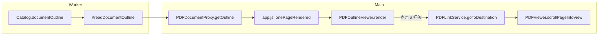

# PDF.js：侧栏「大纲 / 书签」（Show Outline）— 数据流与跳转

本文说明：**viewer 如何获取文档大纲、在侧栏展示、以及点击条目后如何跳转到 PDF 目标**。路径相对于本仓库 `pdf.js` 根目录。

---

## 总览

| 阶段 | 位置 | 职责 |
|------|------|------|
| 数据源 | PDF **Catalog → `Outlines`** | 标准书签树（非正文 OCR / 非 `getTextContent` 抽标题） |
| Worker 解析 | `src/core/catalog.js` | `#readDocumentOutline`、`parseDestDictionary` |
| 消息 | `src/core/worker.js` → `src/display/api.js` | `GetOutline` / `PDFDocumentProxy#getOutline` |
| 触发渲染 | `web/app.js` | 首屏有页渲染后 `getOutline` → `pdfOutlineViewer.render` |
| DOM 与点击 | `web/pdf_outline_viewer.js` | 树形 UI、`_bindLink`、`goToDestination` |
| 侧栏切换 | `web/views_manager.js` | 大纲按钮、`outlineloaded` 等 |
| 视口滚动 | `web/pdf_link_service.js` | `goToDestination` → `scrollPageIntoView` |

**要点**：大纲标题来自大纲字典的 **`Title`**；跳转目标来自 **`Dest` / 动作字典** 等解析结果。**与** `get-text-content-pipeline.md` **中的文本抽取管线无关**；若 PDF 未嵌入书签，大纲为空。

---

## 1. 工作流（端到端）



1. **打开文档**：主线程通过 transport 与 Worker 通信。
2. **至少渲染一页**（`onePageRendered`）后，`app.js` 调用 **`pdfDocument.getOutline()`**。
3. **Worker** 处理 **`GetOutline`**，执行 **`ensureCatalog("documentOutline")`**，惰性计算并返回树形数组。
4. **`PDFOutlineViewer.render({ outline, pdfDocument })`** 把每一项渲染为 `treeItem` + 链接，子项递归进 `treeItems`。
5. **用户点击**：对带 **`dest`** 的条目，**`linkService.goToDestination(dest)`** 解析目标 → **`pdfViewer.scrollPageIntoView`** 滚页并按 `destArray` 定位。

---

## 2. Worker：`GetOutline` → Catalog

```javascript
// src/core/worker.js（摘要）
handler.on("GetOutline", function (data) {
  return pdfManager.ensureCatalog("documentOutline");
});
```

---

## 3. 核心解析：`catalog.js` 读 `Outlines` 树

从 Catalog 取 **`Outlines`**，从 **`First`** 引用开始，用队列沿 **`Next`**（同级）与 **`First`**（子级）遍历；每项用 **`Catalog.parseDestDictionary`** 得到 `dest` / `url` / `action` 等；**`Title`** 经 **`stringToPDFString`** 得到显示用字符串。

```javascript
// src/core/catalog.js — #readDocumentOutline 结构摘要
#readDocumentOutline(options = {}) {
  let obj = this.#catDict.get("Outlines");
  if (!(obj instanceof Dict)) {
    return null;
  }
  obj = obj.getRaw("First");
  if (!(obj instanceof Ref)) {
    return null;
  }
  const root = { items: [] };
  const queue = [{ obj, parent: root }];
  // while (queue.length) { fetch 字典 → parseDestDictionary → outlineItem → queue First/Next }
  return root.items.length > 0 ? root.items : null;
}
```

主线程 API 封装见 **`src/display/api.js`** 中 **`PDFDocumentProxy#getOutline`**（内部 **`messageHandler.sendWithPromise("GetOutline", null)`**）。

---

## 4. Viewer 何时拉大纲：`web/app.js`

在 **`onePageRendered`** 回调中（与其它侧栏数据类似），避免在文档未稳定时抢跑：

```javascript
if (this.pdfOutlineViewer) {
  pdfDocument.getOutline().then(outline => {
    if (pdfDocument !== this.pdfDocument) {
      return;
    }
    this.pdfOutlineViewer.render({ outline, pdfDocument });
  });
}
```

---

## 5. 侧栏 UI 与点击跳转：`web/pdf_outline_viewer.js`

### 5.1 `render`

- 若已有 `_outline`，先 **`reset()`**。
- 无 **`outline`** 时发 **`_dispatchEvent(0)`**（大纲计数为 0，用于禁用「当前大纲项」等能力）。
- 否则 BFS 队列遍历，每个节点：`div.treeItem` → **`a`**，**`_bindLink(element, item)`**，**`element.textContent = _normalizeTextContent(item.title)`**；有 **`item.items`** 时加折叠按钮与 **`div.treeItems`**。

### 5.2 `_bindLink`（跳转入口）

- **`url`**：`linkService.addLinkAttributes`。
- **`action`** / **`attachment`** / **`setOCGState`**：各自 `onclick` 分支。
- **`dest`（最常见）**：**`href = linkService.getDestinationHash(dest)`**，**`onclick`** 里 **`linkService.goToDestination(dest)`**，并 **`return false`** 避免默认导航覆盖应用内滚动逻辑。

```javascript
element.href = linkService.getDestinationHash(dest);
element.onclick = evt => {
  this._updateCurrentTreeItem(evt.target.parentNode);
  if (dest) {
    linkService.goToDestination(dest);
  }
  return false;
};
```

### 5.3 当前页同步高亮（可选能力）

**`_currentOutlineItem`**、**`_getPageNumberToDestHash`**：在已加载页的前提下，把「当前页」映射到某条大纲的 hash，用于在侧栏内滚动/高亮当前条目（实现细节见源码注释：每页只取一种简化策略）。

---

## 6. 真正滚页：`web/pdf_link_service.js` — `goToDestination`

1. 将 **命名目标** 解析为 **显式目标数组** `explicitDest`（**`getDestination`**）。
2. 从数组首元素得到 **页引用或页号**，换算为 **`pageNumber`**（1-based）。
3. 若存在 **`pdfHistory`**，先 **`pushCurrentPosition`** 再 **`push`** 新位置。
4. **`this.pdfViewer.scrollPageIntoView({ pageNumber, destArray: explicitDest, ... })`** —— 完成 **自动跳转** 与视口内定位。

---

## 7. 侧栏与按钮：`web/views_manager.js`

- **`outlineButton`**、**`outlinesView`**：切换到大纲视图、容器挂载树。
- 监听 **`outlineloaded`** 等，用于在大纲数量为 0 时禁用相关 UI、更新标题文案等（与 **`pdf_outline_viewer.js`** 中 **`_dispatchEvent`** 发出的 **`outlineloaded`** 对应）。

---

## 8. 与「文本标题抽取」的区分

| 能力 | 数据来源 |
|------|----------|
| 本侧栏大纲 | PDF **书签 / Outlines**（作者或导出工具写入） |
| 从正文猜标题 | **不在**默认 viewer 内；若需要，需基于 **结构树（StructTree）** 或自定义 **`getTextContent`** 启发式，另起模块 |

详见同目录 **`get-text-content-pipeline.md`**（仅描述 **`getTextContent`** 管线）。

---

## 参考源码位置（便于跳转）

| 主题 | 文件 |
|------|------|
| `GetOutline` | `src/core/worker.js` |
| `documentOutline` / `#readDocumentOutline` | `src/core/catalog.js` |
| `getOutline` | `src/display/api.js` |
| 首屏后拉大纲 | `web/app.js` |
| 大纲 DOM、`_bindLink` | `web/pdf_outline_viewer.js` |
| `goToDestination`、`scrollPageIntoView` | `web/pdf_link_service.js` |
| 侧栏大纲视图切换 | `web/views_manager.js` |

---

*文档与引擎版本一致；若上游重构类名/行号，请以当前 `src` / `web` 为准。*
